# Employer Onboarding Flowchart

This document provides a comprehensive visual representation of the employer onboarding process in the Looksharp platform, from initial registration through company profile approval and subscription activation.

## Flowchart

```mermaid
flowchart TD
    Start([User Visits Registration Page]) --> EnterEmail[Enter Email Address]
    EnterEmail --> RequestOTP[Request Registration OTP]
    RequestOTP --> OTPThrottled{OTP Throttled?}
    OTPThrottled -->|Yes| WaitThrottle[Wait for Throttle Period]
    WaitThrottle --> RequestOTP
    OTPThrottled -->|No| SendOTP[Send OTP via Email]
    SendOTP --> EnterOTP[Enter OTP Code]
    EnterOTP --> VerifyOTP{OTP Valid?}
    VerifyOTP -->|No| OTPInvalid[Invalid/Expired OTP]
    OTPInvalid --> MaxAttempts{Max Attempts<br/>Exceeded?}
    MaxAttempts -->|Yes| RequestOTP
    MaxAttempts -->|No| EnterOTP
    VerifyOTP -->|Yes| SelectUserType[Select User Type: Employer]
    SelectUserType --> CreateAccount[Create User Account<br/>Assign Employer Role]
    CreateAccount --> AutoCreateCompany[Auto-Create Draft Company<br/>Status: DRAFT]
    AutoCreateCompany --> WizardStart[Start Company Profile Wizard]
    
    WizardStart --> Step1[Step 1: Basic Info<br/>- Legal Name<br/>- Trading Name<br/>- Industry<br/>- Company Size<br/>- Logo]
    Step1 --> Step1Complete{Step 1<br/>Complete?}
    Step1Complete -->|No| Step1
    Step1Complete -->|Yes| Step2[Step 2: Contact & Location<br/>- Country, City, Address<br/>- Phone Number<br/>- Official Email<br/>- Website<br/>- LinkedIn URL]
    Step2 --> Step2Complete{Step 2<br/>Complete?}
    Step2Complete -->|No| Step2
    Step2Complete -->|Yes| Step3[Step 3: Registration<br/>- Registration Number<br/>- Ghana Card Document<br/>- Business Registration Document]
    Step3 --> UploadDocs[Upload Verification Documents]
    UploadDocs --> DocsUploaded{Documents<br/>Uploaded?}
    DocsUploaded -->|No| Step3
    DocsUploaded -->|Yes| SetVerificationStatus[Set Verification Status: PENDING]
    SetVerificationStatus --> Step3Complete{Step 3<br/>Complete?}
    Step3Complete -->|No| Step3
    Step3Complete -->|Yes| Step4[Step 4: Primary Contact<br/>- Contact Name<br/>- Contact Title<br/>- Contact Email<br/>- Contact Phone]
    Step4 --> Step4Complete{Step 4<br/>Complete?}
    Step4Complete -->|No| Step4
    Step4Complete -->|Yes| Step5[Step 5: Subscription Selection<br/>- Free Tier<br/>- Starter Tier<br/>- Professional Tier]
    Step5 --> SelectTier{Subscription Tier<br/>Selected?}
    SelectTier -->|No| Step5
    SelectTier -->|Yes| TierType{Free or<br/>Paid Tier?}
    
    TierType -->|Free| CreateFreeSub[Create FREE Subscription<br/>Status: active]
    CreateFreeSub --> WizardComplete[Wizard Complete<br/>wizard_complete: true]
    
    TierType -->|Paid| CreatePaidSub[Create PAID Subscription<br/>Status: pending_payment]
    CreatePaidSub --> InitiatePayment[Initiate Payment via Paystack]
    InitiatePayment --> RedirectPaystack[Redirect to Paystack<br/>Payment Page]
    RedirectPaystack --> PaymentResult{Payment<br/>Successful?}
    PaymentResult -->|No| PaymentFailed[Payment Failed]
    PaymentFailed --> RetryPayment{Retry<br/>Payment?}
    RetryPayment -->|Yes| InitiatePayment
    RetryPayment -->|No| WizardComplete
    PaymentResult -->|Yes| ActivateSubscription[Activate Subscription<br/>Status: active]
    ActivateSubscription --> WizardComplete
    
    WizardComplete --> ReadyToSubmit{Ready to<br/>Submit?}
    ReadyToSubmit -->|No| EditProfile[Edit Profile<br/>Status: DRAFT or NEEDS_CHANGES]
    EditProfile --> WizardStart
    ReadyToSubmit -->|Yes| SubmitForReview[Submit Company for Review<br/>Status: DRAFT → SUBMITTED]
    SubmitForReview --> NotifyAdmins[Notify Admins of Submission]
    NotifyAdmins --> AdminReview[Admin Reviews Company Profile]
    
    AdminReview --> ReviewProfile[Review Profile Information]
    AdminReview --> ReviewVerification[Review Verification Documents]
    
    ReviewProfile --> ProfileDecision{Profile<br/>Approved?}
    ReviewVerification --> VerificationDecision{Verification<br/>Documents Valid?}
    
    ProfileDecision -->|Needs Changes| NeedsChanges[Set Status: NEEDS_CHANGES<br/>Provide Review Notes]
    NeedsChanges --> NotifyEmployerChanges[Notify Employer<br/>Review Notes Sent]
    NotifyEmployerChanges --> EditProfile
    
    ProfileDecision -->|Rejected| RejectProfile[Set Status: REJECTED<br/>Provide Rejection Notes]
    RejectProfile --> NotifyEmployerReject[Notify Employer<br/>Rejection Notice]
    NotifyEmployerReject --> EndRejected([Onboarding Rejected])
    
    ProfileDecision -->|Approved| ApproveProfile[Set Status: APPROVED]
    VerificationDecision -->|Rejected| RejectVerification[Set Verification Status: REJECTED]
    RejectVerification --> NeedsChanges
    
    VerificationDecision -->|Verified| ApproveVerification[Set Verification Status: VERIFIED]
    
    ApproveProfile --> BothApproved{Both Profile &<br/>Verification Approved?}
    ApproveVerification --> BothApproved
    
    BothApproved -->|No| WaitForOther[Wait for Other Review]
    WaitForOther --> AdminReview
    
    BothApproved -->|Yes| NotifyEmployerApproved[Notify Employer<br/>Approval Notice]
    NotifyEmployerApproved --> CheckSubscription{Has Active<br/>Subscription?}
    
    CheckSubscription -->|No| SelectSubscription[Select Subscription Tier]
    SelectSubscription --> TierType
    
    CheckSubscription -->|Yes| OnboardingComplete[Onboarding Complete<br/>Company Status: APPROVED<br/>Verification: VERIFIED<br/>Subscription: active]
    OnboardingComplete --> CanPostOpportunities[Can Post Opportunities<br/>Based on Subscription Tier]
    CanPostOpportunities --> EndSuccess([Onboarding Successful])
    
    style Start fill:#e1f5ff
    style EndSuccess fill:#d4edda
    style EndRejected fill:#f8d7da
    style AutoCreateCompany fill:#fff3cd
    style SubmitForReview fill:#cfe2ff
    style AdminReview fill:#d1ecf1
    style OnboardingComplete fill:#d4edda
    style CreateFreeSub fill:#d1e7dd
    style ActivateSubscription fill:#d1e7dd
    style RejectProfile fill:#f8d7da
    style RejectVerification fill:#f8d7da
```



## Flow Description

### Phase 1: Registration
1. **Email Entry**: User enters email address on registration page
2. **OTP Request**: System sends OTP via email (with throttling protection)
3. **OTP Verification**: User enters and verifies OTP code
4. **User Type Selection**: User selects "Employer" as account type
5. **Account Creation**: System creates user account and assigns employer role

### Phase 2: Company Profile Creation (Wizard)
The system automatically creates a draft company profile. The employer completes a 5-step wizard:

1. **Step 1 - Basic Info**: Legal name, trading name, industry, company size, logo
2. **Step 2 - Contact & Location**: Address, phone, email, website, social media links
3. **Step 3 - Registration**: Registration number, Ghana Card document, Business Registration document
   - Uploading documents sets verification status to `PENDING`
4. **Step 4 - Primary Contact**: Contact person details
5. **Step 5 - Subscription Selection**: Choose Free, Starter, or Professional tier

### Phase 3: Subscription Activation

**Free Tier:**
- Subscription created with `active` status immediately
- No payment required

**Paid Tiers (Starter/Professional):**
- Subscription created with `pending_payment` status
- User redirected to Paystack for payment
- Upon successful payment, subscription activated to `active` status
- If payment fails, user can retry or continue with incomplete profile

### Phase 4: Submission & Admin Review

1. **Submission**: Employer submits company profile for review
   - Status changes: `DRAFT` → `SUBMITTED`
   - Admins are notified

2. **Admin Review Process** (Parallel):
   - **Profile Review**: Admin reviews company information
   - **Verification Review**: Admin reviews uploaded documents (Ghana Card, Business Registration)

3. **Review Outcomes**:
   - **Approved**: Status → `APPROVED`, Verification → `VERIFIED`
   - **Needs Changes**: Status → `NEEDS_CHANGES` (employer can edit and resubmit)
   - **Rejected**: Status → `REJECTED` (onboarding ends)

### Phase 5: Completion

Once both profile and verification are approved:
- Company status: `APPROVED`
- Verification status: `VERIFIED`
- Subscription: `active`
- Employer can post opportunities based on subscription tier limits

## Status Transitions

### Company Status Flow
```
DRAFT → SUBMITTED → APPROVED
                    ↓
              NEEDS_CHANGES → (can resubmit)
                    ↓
              REJECTED (end)
```

### Verification Status Flow
```
PENDING → VERIFIED
         ↓
      REJECTED (requires resubmission)
```

### Subscription Status Flow
```
Free: active (immediate)
Paid: pending_payment → active (after payment)
```

## Key Business Rules

1. **Editable States**: Company profile can only be edited when status is `DRAFT` or `NEEDS_CHANGES`
2. **Verification Required**: Both Ghana Card and Business Registration documents must be uploaded before submission
3. **Subscription Required**: Company must have an active subscription to post opportunities
4. **Admin Review**: Both profile and verification must be approved for onboarding to complete
5. **Payment**: Paid subscriptions require successful payment before activation

## Related Files

- [app/Services/EmployerCompanyService.php](../app/Services/EmployerCompanyService.php) - Company creation and management logic
- [app/Services/AuthService.php](../app/Services/AuthService.php) - Registration and OTP verification
- [app/Http/Controllers/Auth/RegistrationController.php](../app/Http/Controllers/Auth/RegistrationController.php) - Registration flow
- [app/Http/Controllers/EmployerProfileController.php](../app/Http/Controllers/EmployerProfileController.php) - Company profile management
- [app/Models/EmployerCompany.php](../app/Models/EmployerCompany.php) - Company model with status enums
- [app/Enums/EmployerCompanyStatusEnum.php](../app/Enums/EmployerCompanyStatusEnum.php) - Status enum values
- [app/Enums/EmployerCompanyVerificationStatusEnum.php](../app/Enums/EmployerCompanyVerificationStatusEnum.php) - Verification status enum

